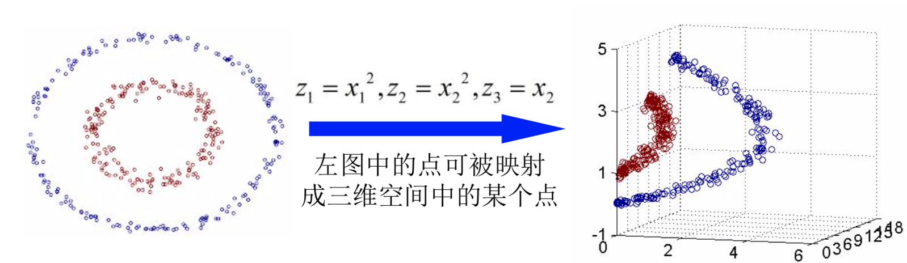

# 机器学习复习

## 贝叶斯分类方法

### 贝叶斯定理

#### 贝叶斯公式

$$
P(A_i|B) = \frac{P(B|A_i)P(A_i)}{P(B)} = \frac{P(B|A_i)P(A_i)}{P(B|A_1)P(A_1)+P(B|A_2)P(A_2)+...+P(B|A_n)P(A_n)}
$$

#### 相关名词/概念

- P(A) :先验概率，边缘概率;不考虑任何B方面的因素
- P(A|B) :后验概率, 已知B发生后A的条件概率

### 朴素贝叶斯分类

假设有n个类别C1,C2…Cn，给定一个实例的特征向量w，则此实例属 于类Ci的概率为
 
$$
P(C_i|w) = \frac{P(w/C_i)P(C_i)}{P(w)}
$$
其中
$$
P(w/C_i) = p(w_0|C_i)P(w_1|C_i)...P(w_n|C_i)
$$

当Ak是连续值, P(Xk|Ci)通常基于均值mu标准差sigma的高斯分布计算
$$
g(x,\mu,\sigma) = \frac{1}{\sqrt{2\pi}\sigma}e^{-\frac{(x-\mu)^2}{2\sigma^2}}
$$

##### 零概率问题解决方案：拉普拉斯校准

$$
校准前，概率可能为0 P(w_i|c_i) = \frac{count(w_i|c_i)}{count(c_i)} 拉普拉斯校准后P(w_i|c_i)=\frac{count(w_i|c_i + \lambda)}{count(c_i)+N*\lambda}
$$

##### 溢出问题解决方案：

$$
P(w/C_i) = p(w_0|C_i)P(w_1|C_i)...P(w_n|C_i)
$$

等式右边概率值可能会很小，相乘可能会导致浮点数溢出

解决方案：等式两边取对数（底数一般为2），将乘法转换成加法

### 贝叶斯信念网络

#### 贝叶斯网络的形式化定义

BN(G,theta)

-G：有向环图

-G的结点：随机变量

-G的边：结点间的有向依赖

-theta：所有条件概率分布的参数集合

-结点X的条件概率：P(X|parent(X))

#### 贝叶斯决策理论

- 使用后验概率分类

- 最小错误率的贝叶斯决策

  - 决策规则
    $$
    P(w_i|x) = max_{j=1,2,...,c}(P(w_j)|x),则x\in w_i
    $$

  - 误差概率
    $$
    P(error) = min[P(w_i|x)] i,j = 1,2,...,c
    $$
    

- 最小风险的贝叶斯决策

- 拒绝决策

## 分类性能评价

#### Holdout method

1. 给定数据随机分成两个部分
2. 随机抽样

#### Cross-validation(k-fold, k=10 最常用)

1. 随机分割数据为k互不相交的子集，每个大小近似相等
2. 在i-th迭代中，使用Di为测试集，其他的为训练集

#### 混淆矩阵

| Actual class \ Predicted class |         C1         |         !C1         |      |
| :----------------------------: | :----------------: | :-----------------: | :--: |
|               C1               | True Positive(TP)  | False Nagatives(FN) |  P   |
|              !C1               | False Positive(FP) | True Negatives(TN)  |  N   |
|                                |         P‘         |         N'          | ALL  |

- 识别率：Accuracy = (TP+TN) 

- 误差率：1-accuracy, or (FP+FN)/ALL
- 灵敏性：识别出的所有正例占所有正例的比例 Sensitivity = TP/(TP+FN)
- 特异性：识别出的负例占所有负例的比例

## KNN算法

- **最小距离分类器**：将各类训练样本划分成若干子类，并在每个子类中确定代表点，一般用子类的质心或邻近质心的某一样本为代表点，测试样本的类别则以其与这些代表点距离最近作决策。该法的缺点是所选择的代表点并不一定能很好地代表各类，其后果将使错误率增加。
- **最近邻法**以全部训练样本作为"代表点"，计算测试样本与这些"代表点"，即所有样本的距离，并且以最近邻的类别作为决策。

### 最近邻法

样本集Sn
$$
S_N = \{(x_1,\theta_1), (x_2,\theta_2),...,(X_N,\theta_N)\}
$$
其中Xi:样本，theta：类别标号

样本xi与xj之间的距离delta(xi,xj) 比如欧式距离||xi-xj||

对未知样本x, 求Sn中与之距离最近的样本x',类别为theta‘
$$
\delta(x,x') = min_{j=1,...,N}\delta(x,x_j)
$$
则将x分到theta‘类，即w(x) = theta'

缺点：

- 错误率难以计算
- 单个样本对测试结果的影响很大

### K-近邻法

在所有的N个样本中找到与测试样本中找到与测试样本的K个最近邻，其中个类别所占个数表示成Ki

判别函数
$$
g_i(x) = k_i, i = 1,2,...,c
$$
决策规则
$$
g_j(x) = max_i g_i(x),i=1,...,c
$$
K值的选择

如果k太小，则对噪声点敏感

如果k太大，则邻域可能包含很多其他类的点

#### question 1: choose k

solution: choose k by testing

#### question 2: Majority Voting

solution:

不同距离下数据对象对待测数据分类影响力不同，引入权重，即可以采用权值的方法改进。
$$
w_i = \frac{1}{d(x',x_i)^2}
$$

$$
y' = argmax_v \sum_{(xi,yi)\in D_{x'}} wi * I（v = y_i)
$$

优点

- 易于理解与实现
- 相对较低的错误率
- 适合标签比较多的数据对象的分类

缺点

- 当训练集较大时，待测对象与样本中数据对象的计算代价较大
- 大训练数据集很难存放在内存中
- 无关数据
- 非平衡样本数据集

### 改进的KNN

#### 快速搜索近邻法

这种方法着眼于只解决减少计算量，但没有达到减少存储量大要求

基本思想：

- 将样本集按邻近关系分解成组，给出每组的质心所在，以及组内样本至该质心的最大距离。这些组又可形成层次结构，即组又分子组。
- 因而待识别样本可将搜索近邻的范围从某一大组，逐渐深入到其中的子组，直至树的叶结点所代表的组，确定其相邻关系。

首先将整个样本分成p个子集，每个子集又分为它的p个子集，如此进行若干次就能建立起一个样本集的树形结构。分成子集的原则是该子集内的样本尽可能聚成堆，这可用聚类方法实现。

#### 剪辑近邻法

剪辑的结果是去掉两类边界附近的样本

#### 压缩近邻法

利用现有样本集，逐渐生成一个新的样本集，使该样本集在保留最少量样本的条件下，仍能对原有样本的全部用最近邻法正确分类，那么该样本集也就能对待识别样本进行分类，并保持正常识别率。

#### 最佳距离度量近邻法

定义新的距离函数
$$
D(x,x')=|\nabla^T(x-x^l)|
$$
其中xl为x的局部邻域中的样本，则必有
$$
D(x,x') = min_l D（x-x')
$$
按照上面定义的新距离，在X的局部邻域中选择x的最近邻X',则可使有限样本与无限样本的错误率之差在均方意义下达到最小。

## Support Vector Machine

### 基本原理

问题：在给定的训练数据集上，如何求得具有最大分类间隔的分类面

设：两类线性可分样本集{(x1,y1),(x2,y2),…,(xn,yn)}，其中：xi in Rd, yi in {+1,-1}，i =1,2,..n

对于线性可分问题，分类超平面的定义如下：
$$
w·x + b = 0
$$
其中，w和b是分配超平面的参数，且w = {w1,w2,…,wd}是分类超平面的法向量，b是偏差

在分类超平面上方的样本，满足如下条件：
$$
w·x_i + b > 0, y_i = +1
$$
在分类超平面下方的样本，满足如下条件：
$$
w·x_i + b < 0 , y_i=-1
$$
因此
$$
y_i = sign(w·x_i+b) =\left\{
\begin{aligned}
+1,w·x_i + b > 0 \\
-1,w·x_i + b < 0
\end{aligned}
\right.
(i = 1,2,...,n)
\iff y_i(w·x_i+ b) > 0
$$
为了处理方便，假设所有样本数据到分类超平面的距离至少为1，因此所有样本数据都满足
$$
|w·x_i + b | \ge 1 
$$

$$
y_i(w·x_i +b) \ge 1
$$

满足不等式等号条件的样本数据被称为支持向量

在线性可分情况下，SVM通常被描述成一个带有约束条件的优化问题

### 线性不可分时

#### 解决方案1：建立一个二次判别函数

$$
g(x) = (x-a)(x-b) \iff g(x) = c_0 + c_1x+ c_2x^2
$$

如果选择x->y的映射，可以把二次判别函数转化为关于y的线性函数
$$
g(x) = a^T y = \sum _{i=1} ^{3} a_iy_i
$$
其中
$$
y = \left[
\begin{matrix}
y1\\y2\\y3
\end{matrix}
\right] =\left[\begin{matrix}1\\x\\x^2\end{matrix}\right], 
a =  \left[
\begin{matrix}
a1\\a2\\a3
\end{matrix}
\right] =\left[\begin{matrix}c_0\\c_1\\c_2\end{matrix}\right]
$$

$$
g(x) = a^Ty 为广义线性判别函数，a叫做广义权向量
$$

#### 解决方案2：通过引入松弛变量来构建软间隔SVM

带约束条件的最优化问题形式如下：
$$
min_{w,b}\{\frac{1}{2}\|w\| + C\sum_{i=1}^{n}\xi_i\}
\\s.t. y_i·(x_i · w+b) \ge 1-\xi, i=1,...,n
\\\xi_i \ge 0
$$

#### 解决方案3：在方案1的基础上使用核技巧。

将样本数据转换到高维空间中，在高维空间中寻找分类超平面。

当数据变换到高维空间可分的理由：当维度增加到无限维的时候，一定可以让任意两个物体可分。

使用一种非线性变换，可将原数据映射到高维空间中

几种常用的核函数

线性核
$$
K(x_i,x_j) = {x_i}^Tx_j
$$
高斯核
$$
K(x_i,x_j)=e^{-\frac{\|x_i-x_j\|^2}{2\sigma^2}}
$$
优点：

- 有严格的数学推理
- 小样本分类器
- 特别适合处理复杂的非线性分类问题

缺点：

- 训练时间非常长
- 无法直接处理多分类问题

### 对于N(N>2)类分类问题的解决方案

- 1vs(N-1)需要训练N个分类器，第i个分类器用于判断样本数据是否属于第i类
- 1vs1:需要训练N*(N-1) /2 个分类器，分类器能够判断样本数据时属于第i类还是第j类

## 人工神经网络

### 人工神经网络模型

可以用一个数学表达式进行抽象与概括
$$
o = f(\sum _{j=1}^{n}w_jx_j-\theta)
$$
神经元网络输入记为net
$$
net = \sum_{j=1} ^{n} w_jx_j
$$
有时为了方便起见，也可以这么写
$$
o = f(\sum_{j=0}^nw_jx_j)\\其中，w_0 = -\theta, x_0 = 1
$$

- 神经元是一个多输入、单输出的单元
- 它具有非线性的输入、输出特性
- 它具有可塑性，其可塑性变化的部分主要是权值w的变化，对于激发状态，w去正值，对于抑制状态，w取负值
- 神经元的输出和响应时个输入值的综合作用的结果
- 兴奋和抑制状态

### 激活函数

#### 线性函数

$$
f(net) = k * net + c
$$

#### 非线形斜面函数

$$
f(net) = \left\{
\begin{aligned}
\gamma && if|net| \ge \theta\\
k*net && if|net| < \theta \\
-\gamma && if \ net \le -\theta
\end{aligned}
\right.\\\gamma > 0 为一常数，被称为饱和值，为该神经元的最大输出
$$

#### 阈值函数阶跃函数

$$
f(net) = \left\{\begin{aligned}
\beta && if \ net>\theta \\
-\gamma && if \ net \le \theta
\end{aligned}\right.\\
\beta 、 \gamma 、\theta 均为非负实数，\theta为阈值
$$
**二值形式：**
$$
f(net) = \left\{\begin{aligned}
1 && if \ net>\theta \\
0 && if \ net \le \theta
\end{aligned}\right.
$$
**双极形式：**
$$
f(net) = \left\{\begin{aligned}
1 && if \ net>\theta \\
-1 && if \ net \le \theta
\end{aligned}\right.
$$

#### S形函数

压缩函数和逻辑斯特函数
$$
f(net) = a+\frac{b}{1+e^{-d*net}}
$$

### 学习规则

#### Hebb学习规则

当神经元i与神经元j同时处于兴奋状态时，在神经网络中表现为连接权增加。
$$
W_{ij}(n+1) = w_{ij}(n) + \eta ·o_i(n)·o_j(n)\\=W_{ij}(n) + \Delta W_{ij}(n)\\\eta是正常数，它决定了在学习过程中从一个步骤到另一个步骤到学习速率
$$

#### Delta学习规则

通过改变神经元之间的连接权来减小系统实际输出与理想输出的误差。

假设
$$
E = \frac {1}2 \sum_{k=1}^{k} (y_k-o_k(n))^2
$$
使用梯度下降法调整权值W，使误差准则函数最小，得到W的修正Delta规则为
$$
W_{ij}(n+1) = W_{ij}(n) + \eta\delta_j·O_i
$$
Delta学习规则只适用于线性可分函数，无法用于多层网络

#### 胜者为王学习规则

胜者为王(Winner-Take-All)学习规则是一种竞争学习规则用于无导师学习。一般将网络的某一层确定为竞争层，对于一个特定的输入X，竞争层的K个神经元均有输出响应，其中响应值最大的神经元j*为竞争中获胜的神经元，即
$$
W_{j^*}^T * X = max_{i=1,2,...,K}（W_i^TX）
$$
只有获胜的神经元才有权调整其权向量Wj,调整量为
$$
\Delta W_{j^*} = \eta(X-W_{j^*})
$$

#### Kohonen学习规则

该规则只用于无导师指导下训练的网络。在学习过程中，处理单元竞争学习时，具有高输出的单元为胜利者，它有能力阻止它的竞争者并激活相邻的单元，只有胜利者才能有输出，也只有胜利者与其相邻单元可以调节权重。

在训练周期内，相邻单元的规模是可变的。一般的方法是从定义较大的相邻单元开始，在训练过程中不断减少相邻的范围。胜利单元可定义为与输入模式最为接近的单元。Kohonen网络可以模拟输入的分配。

#### 概率式学习

从统计学、分子热力学和概率论中关于系统稳态能量的标准出发，进行神经网络学习的方式称为概率式学习。神经网络处于某一状态的概率主要取决于在此状态下的能量，能量越低， 概率越大。概率式学习的典型代表是玻尔兹曼(Boltzmann)机 学习规则。这是基于模拟退火的统计优化算法 。

### 未完待续

## 决策树

### Hunt算法

基于标称属性的分裂

- 多路划分，取决于该属性不同属性值的个数
- 二元划分，这种划分要考虑创建K个属性值的二元划分的所有2^(k-1)-1种方法

基于序数的分裂

- 多路划分，取决于该属性不同属性值的个数
- 二元划分，保持序数属性的有序性

基于连续属性的划分

- 多路划分
- 二元划分，选择一个最佳划分点

#### Hunt算法存在的问题

采用不同的测试属性及其先后顺序将会生成不同的决策树

### ID3算法

信息量I(a_i)可如下度量
$$
I(a_i) = p(a_i)log_2\frac {1}{p(a_i)}
$$
第一步，计算决策属性的熵

第二步，计算条件属性的熵，计算不同属性的信息增益

第三步，选择计算节点，对信息增益排序

