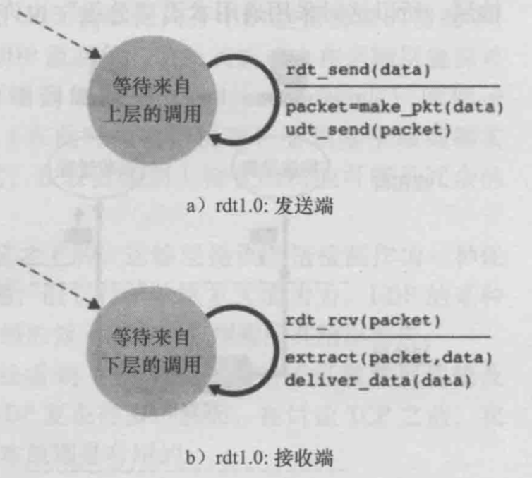
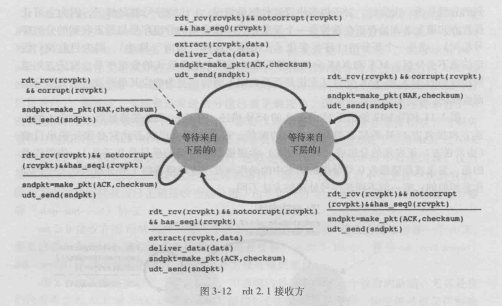

# 计算机网络复习：自顶向下方法

## 第一章 综述

### 计算机网络的构成

**端系统**通过**通信链路**和**分组交换机**链接到一起

-  端系统：所有连接因特网的设备

- 通信链路：

  - 引导型媒体：
    - 双绞铜线
    - 同轴电缆
    - 光纤
  - 非引导型媒体：
    - 陆地无线电信道
    - 卫星无线电信道

- 分组交换机：

  最著名的两种：

  - 路由器
  - 链路层交换机

端系统通过**因特网服务提供商（ISP)**接入因特网

端系统、分组交换机和其他因特网部件都要运行一系列**协议**，因特网的主要协议统称为**TCP/IP**。

- 协议：两个或多个通信实体之间交换的**报文**格式和次序，以及报文发送和接收一条报文或其他事件所采取的动作的定义。
- 报文：交换的数据的统称

链路的**传输速率**以bit/s来度量的，统称为bps

在家庭环境中，通常用**局域网（LAN)**将端用户连接到**边缘路由器**

- 边缘路由器：端系统到任何其他远程端系统的路径上的第一台路由器。
- 局域网：
  - 无线LAN（WLAN，其中基于IEEE802.11技术的WLAN统称为WiFi)
  - 以太网
- 广域网：
  - 3G/4G/5G
  - LTE

协议层次：

- 五层因特网协议栈：
  1. 应用层：信息分组称为**报文（message）**
  2. 运输层：信息分组称为**报文段（segment）**
  3. 网络层：信息分组称为**数据报（datagram)**
  4. 链路层：链路层分组称为**帧（frame）**
  5. 物理层
- 七层ISO OSI参考模型：1.应用层 2.表示层 3.会话层 4.运输层 5.网络层 6.链路层 7.物理层

### 数据交换方式

通过网络链路和交换机移动数据有两种基本方法：**电路交换**和**分组交换**。

- 电路交换：创建一条专用的端到端的连接
  - 频分复用
  - 时分复用
- 分组交换：
  - 储存转发传输
  - 排队时延和分组丢失
  - 转发表和路由选择协议

### 各种数值计算

分组交换不适合实时服务，因为它端到端时延是可变的不可预测的，但是提供了比电路交换更好的带宽共享且比电路交换更有效、简单、成本低廉。

分组交换中的时延：

- 结点处理时延：路由器处理分组的时间，基本是固定的
- 排队时延：取决于先到达的正在排队的分组数量
- 传输时延：将分组的比特传输向链路所需要的时间：time = L/R 其中L是分组长度，R是传输速率
- 传播时延：从链路起点到链路终点所需的时间

丢包：

​	路由器的等待队列满的时候，新到达的分组将被丢弃。

吞吐量：

- 瞬时吞吐量：主机在任何的瞬间接收到该文件的速率（bps)
- 平均吞吐量：主机接受所有F比特用去T秒

难点：计算m个用户在同一时刻有n个用户在同时传输的概率
$$
（^n_m）p^nq^{m-n}
$$
当m很大时，可以根据中心极限定理计算
$$
\lim _{m \to \infty}p(\frac {1}{\sqrt{np(1-p)}}\sum_{i=1}^{n}X_i - np) \approx \Phi(x)
$$
其中等号右侧为正态分布累计概率

## 第二章 应用层

### 应用层协议原理

**应用程序体系结构**由应用程序研发者设计，目前有两种主流结构：

- 客户-服务器体系结构
- 对等（P2P）体系结构

在给定的一堆进程之间的通信会话场景中，发起通信（即在该绘画开始时发起与其他进程的联系）的进程会被标志为**客户**，在绘画开始时等待联系的进程时**服务器**。

进程通过一个被称为**套接字（socket）**的软件接口向网络发送报文和从网络接收报文。

主机由其**IP地址（IP address)**标识。**端口号**用来标识主机上的接收进程。

应用程序服务分类的四个维度：

- 可靠数据传输
- 吞吐量
- 定时
- 安全性

TCP服务

- 面向连接的服务
- 可靠数据传送服务

UDP服务

- 不提供不必要服务

**应用层协议**定义了运行在不同端系统上的应用程序进程如何相互传递报文

- 交换的报文类型
- 各种报文类型的语法
- 字段的语义
- 发送报文、响应报文的规则

### HTTP协议

Web的应用层协议是**超文本传输协议（HyperText Transfer Protocol, HTTP)**

- 非持续连接
  - 在发送每一个请求报文前都需要重新建立TCP连接，在对应的响应报文被客户接收后，TCP连接关闭。
- 持续连接
  - 服务器与客户端之间保持TCP连接打开，直到一段时间内客户端不再向服务器发送请求。

**HTTP请求报文**的第一行叫做**请求行**，其后继的行叫做**首部行**，然后是一个**空行**，最后是**实体主体**。

- 请求行包含3个字段
  - 方法字段：GET/POST/HEAD/PUT/DELETE
  - URL字段
  - HTTP版本字段
- 首部行包含许多键值对
- 实体主体：请求的内容

**HTTP响应报文**分成三个部分，**状态行**， **首部行**， **实体体**：

- 状态行：
  - 版本
  - 状态码
  - 短语
- 首部行：键值对
- 实体体：请求的内容

HTTP常见状态码与短语：

- 200 OK
- 301 Moved Permanently
- 400 Bad Request
- 404 Not Found
- 505 HTTP Version Not Supported

用户与服务器的交互：**cookie**

1. 用户首次访问该Web的时候，Web服务器发送给客户端Set-cookie首部，设置该客户在该服务器上的cookie值
2. 用户在之后每次访问该Web的时候，每个请求报文的首部行都会包含：cookie首部
3. 服务器可以根据cookie来跟踪该用户在该站点的浏览顺序

**Web缓存器**也叫**代理服务器**，它是能够代表初始Web服务器来满足HTTP的网络实体

1. 浏览器在请求一个对象时，先建立一个到Web缓存器的TCP连接，并发送一个HTTP请求。
2. Web缓存器进行检查，假如本地储存了请求的对象，就直接发送HTTP响应报文返回该对象。
3. 否则就与该对象的初始服务器建立TCP连接，请求该对象。
4. Web缓存器收到该对象的时候，在本地存储一份副本，并向浏览器发送HTTP响应报文返回该对象。

**计算平均时延**

A 浏览器  B Web服务器 C Web缓存器

A直接向B申请资源的时延为tab

A向C申请资源的时延为tac

C向B申请资源的时延为tcb

A向C申请资源的命中率为p

A通过C向B申请资源的平均时延为 p * tac + (1-p) * tcb

**条件GET方法**是指，假如请求报文使用GET方法，并且请求报文中包含一个**"If-Modified-Since"**首部行，那么该HTTP请求报文就是一个条件GET请求报文。

### FTP协议

FTP使用了两个并行的TCP连接来传输文件，一个是**控制连接**，一个是**数据连接**。

FTP服务器是有**状态**的，因此FTP同时维持的会话总数较少。

常见命令：

- USER username ：发送用户名
- PASS password：发送用户密码
- LIST:请求当前文件列表
- RETR filename：从当前目录检索文件
- STOR filename：在当前目录存放文件

典型回答：

- 311 Username OK， Password required
- 125 Data connection already open; transfer starting
- 425 Can't open data connection
- 452 Error writing file

### 电子邮件的协议

电子邮件系统有三个主要组成部分， **用户代理**，**邮件服务器**，**简单邮件传输协议**。

#### SMTP

1. 用户通过SMTP从自己的代理客户端上将邮件发送至自己的邮件服务器
2. 邮件服务器通过SMTP将邮件**直接**发送给收件人的邮件服务器
3. 收件人通过自己的代理客户端查看该邮件

SMTP与HTTP的区别

- HTTP是一个**拉协议（pull protocol)**,SMTP是一个**推协议（push protocol)**
- SMTP使用的是7比特的ASCII码
- 在处理一个即包含文本又包含图形的文档的时候，HTTP把每个对象封装到它自己的HTTP响应报文中，SMTP将所有报文对象放在一个报文中。

#### 邮件拉取协议：POP3、IMAP

POP3工作的三个阶段

1. 特许：以明文形式通过用户名和密码鉴别用户
2. 事务处理：用户代理取回报文，同时对报文做删除标记，取消删除标记，以及获取邮件的统计信息
3. 更新：客户发出quit命令后，结束POP3回话，同时，邮件服务器删除被标记为删除的报文。

IMAP服务器把每个报文与一个文件夹联系起来，与POP3不同，IMAP服务器维护了IMAP会话的用户状态信息。

### DNS

DNS是：

- 一个由分层的DNS实现的**分布式数据库**
- 一个使得主机能够查询分布式数据库的应用层协议。

DNS协议运行在**UDP**之上，使用**53端口**。负责由域名转换成IP地址的工作。

以及提供一些重要的服务：

- 主机别名
- 邮件服务器别名
- 负载分配

DNS服务器类型：

- **根DNS服务器**，因特网上有13个根DNS服务器
- **顶级域服务器**，负责顶级域名
- **权威DNS服务器**
- 本地DNS服务器（用于储存**DNS缓存**）

DNS查询方式：递归查询、迭代查询

共同实现DNS分布式数据库的所有DNS服务器存储了**资源记录**

- 资源记录：四元组：（Name, Value, Type, TTL)
  - 如果Type = A 则Name是主机名，Value是该主机名对应的IP地址
  - 如果Type = NS 则Name是个域，则Value是个知道如何获得该域中主机IP地址的权威DNS服务器的主机名。
  - 如果Type = CHAME 则Value是别名为Name的主机对应的规范主机名
  - 如果Type = MX 则Value是个别名为Name的邮件服务器的规范主机名。

DNS报文

### P2P

分发时间计算:

C-S模型的文件分发时间计算
$$
D_{cs} = max \{\frac{NF}{u_s}, \frac{F}{d_{min}}\}
$$
P2P模型的文件分发时间计算
$$
D_{p2p} = max \{\frac{F}{u_s}, \frac{F}{d_{min}},\frac{NF}{u_s+\sum_{i=1}^{N}ui}\}
$$
**分布式散列表（DHT)**

- 环形DHT
- 带接近的DHT

## 第三章 运输层

### 多路复用与多路分解

- 多路分解：将运输层报文段中数据交付到正确的套接字的工作称为多路分解。
- 多路复用：从不同套接字中收集数据块，并为每个数据块封装上首部信息。

TCP报文段：（源IP地址， 源端口， 目的IP地址， 目的端口）

UDP报文段：（源端口号，目的端口号，长度，校验和）

### 构造可靠数据协议

#### 经完全可靠信道的可靠数据传输：rdt 1.0

接收端与发送端的FSM都只有一个状态。

发送端：通过rdt_send(data)事件接受来自较高层的数据，产生一个包含该数据的分组，并将分组发送到信道中

接收端：rd通过rdt_rcv(packet)事件从底层信道接收一个分组，从分组中取出数据，并将数据上传给较高层。

#### 经具有比特差错信道的可靠数据转出：rdt2.0	

基于**自动重传请求协议**

- 差错检测
- 接收方反馈
- 重传

rdt2.0致命缺陷：没有考虑ACK或NAK分组受损的可能性

解决方案：发送方对其数据分组编号

rdt2.1

rdt2.2的细微差别

#### 经具有比特差错的丢包信道的可靠数据传输：rdt 3.0

（比特交替协议）

与rdt 2.2不同的是引入了一个倒计时来确认是否丢包，如果在倒计时内没有收到ACK则重传分组。

rat 3.0 虽然功能正确，但是性能并非令人满意。

### 流水线可靠数据传输协议

rdt3.0 比特交替协议的运行情况

解决rdt3.0性能问题的一个简单方法是：不使用停等方式，允许发送发发送多个分组而无需等待确认，这种技术被称为**流水线**，因此：

- 必须增加序号范围
- 协议的发送方和接收方两端必须缓存多个分组
- 处理丢失的方法：**退回N步**，**选择重传**。
  - 退回N步（GBN,滑动窗口协议)，必须响应三种类型的事件：
    - 上层的调用
    - 收到一个ACK
    - 超时事件
  - 选择重传（SR)：
    - 序号在[rev_base, rev_base+N-1] 内的分组被正确接收。
    - 序号在[rev_base-N, rev_base-1] 内的分组被正确收到。
    - 其他情况，忽略分组

### TCP连接

